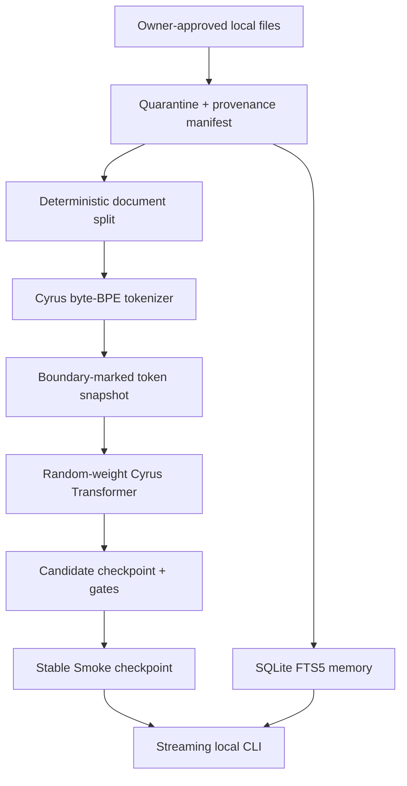

# Architecture

## Current vertical slice

The neural model and memory are deliberately separate. Memory makes approved documents retrievable immediately; it does not mutate weights. Retrieved excerpts are labeled with a source and inserted only as untrusted context.

## Smoke model

| Property | Value |
|---|---:|
| Parameters | 2,718,144 |
| Layers | 6 |
| Width | 192 |
| Attention heads / KV heads | 6 / 6 |
| Context capacity | 256 tokens |
| Training sequence | 64 tokens |
| Vocabulary | 320 tokens |
| Position encoding | Rotary (RoPE) |
| Normalization | Pre-RMSNorm |
| Feed-forward | SwiGLU |
| Attention kernel | PyTorch scaled-dot-product attention |
| Embeddings | Input/output weights tied |
| Initialization | Random normal; no pretrained weights |

The attention implementation already supports fewer KV heads for future GQA profiles. Device selection recognizes CPU, CUDA (including PyTorch ROCm builds), and Apple MPS. Smoke verification used FP32 CPU; mixed precision is intentionally deferred until tested on each accelerator family.

## Trust boundaries

- File content is data, never a command.
- A quarantined record cannot enter dataset snapshots or memory.
- Token snapshots bind the dataset ID and tokenizer SHA-256.
- Checkpoints bind architecture, tokenizer hash, token-snapshot ID, RNG state, optimizer state, step, and token count.
- Candidate checkpoints cannot overwrite the stable path; promotion copies a verified candidate only after every Smoke gate passes.

